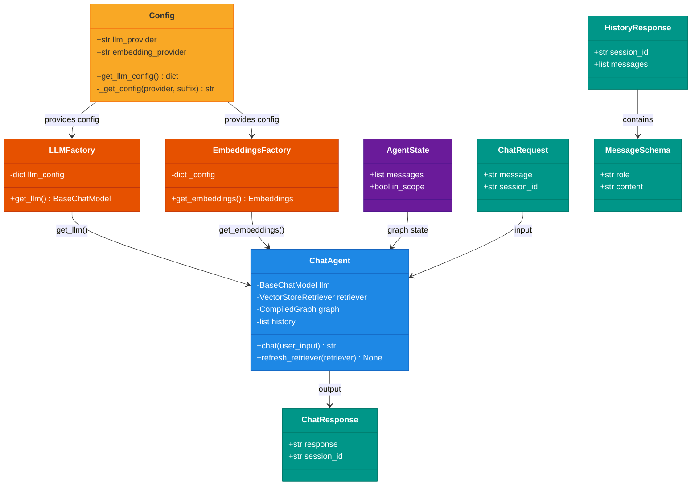

```mermaid
classDiagram
    class Config {
        +str llm_provider
        +str embedding_provider
        +get_llm_config() dict
        -_get_config(provider, suffix) str
    }

    class LLMFactory {
        -dict llm_config
        +get_llm() BaseChatModel
    }

    class EmbeddingsFactory {
        -dict _config
        +get_embeddings() Embeddings
    }

    class ChatAgent {
        -BaseChatModel llm
        -VectorStoreRetriever retriever
        -CompiledGraph graph
        -list history
        +chat(user_input) str
        +refresh_retriever(retriever) None
    }

    class AgentState {
        +list messages
        +bool in_scope
    }

    class ChatRequest {
        +str message
        +str session_id
    }

    class ChatResponse {
        +str response
        +str session_id
    }

    class HistoryResponse {
        +str session_id
        +list messages
    }

    class MessageSchema {
        +str role
        +str content
    }

    Config --> LLMFactory : provides config
    Config --> EmbeddingsFactory : provides config
    LLMFactory --> ChatAgent : get_llm()
    EmbeddingsFactory --> ChatAgent : get_embeddings()
    AgentState --> ChatAgent : graph state
    ChatRequest --> ChatAgent : input
    ChatAgent --> ChatResponse : output
    HistoryResponse --> MessageSchema : contains

    style Config fill:#f9a825,stroke:#f57f17,color:#333
    style LLMFactory fill:#e65100,stroke:#bf360c,color:#fff
    style EmbeddingsFactory fill:#e65100,stroke:#bf360c,color:#fff
    style ChatAgent fill:#1e88e5,stroke:#1565c0,color:#fff
    style AgentState fill:#6a1b9a,stroke:#4a148c,color:#fff
    style ChatRequest fill:#009688,stroke:#00796b,color:#fff
    style ChatResponse fill:#009688,stroke:#00796b,color:#fff
    style HistoryResponse fill:#009688,stroke:#00796b,color:#fff
    style MessageSchema fill:#009688,stroke:#00796b,color:#fff
```
