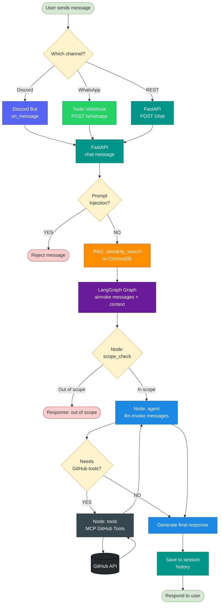

```mermaid
flowchart TD
    A([User sends message]):::start --> B{Which channel?}:::decision

    B -->|Discord| C[Discord Bot\non_message]:::discord
    B -->|WhatsApp| D[Twilio Webhook\nPOST /whatsapp]:::whatsapp
    B -->|REST| E[FastAPI\nPOST /chat]:::fastapi

    C --> F[FastAPI\nchat message]:::fastapi
    D --> F
    E --> F

    F --> G{Prompt\nInjection?}:::decision
    G -->|YES| H([Reject message]):::reject
    G -->|NO| I[RAG: similarity_search\nin ChromaDB]:::rag

    I --> J[LangGraph Graph\nainvoke messages + context]:::langgraph

    J --> K{Node:\nscope_check}:::decision
    K -->|Out of scope| L([Response: out of scope]):::reject
    K -->|In scope| M[Node: agent\nllm.invoke messages]:::agent

    M --> N{Needs\nGitHub tools?}:::decision
    N -->|YES| O[Node: tools\nMCP GitHub Tools]:::mcp
    O --> P[(GitHub API)]:::github
    P --> O
    O --> M

    N -->|NO| Q[Generate final response]:::agent
    M --> Q

    Q --> R[Save to session\nhistory]:::fastapi
    R --> S([Respond to user]):::start

    classDef start fill:#d5e8d4,stroke:#82b366,color:#333
    classDef decision fill:#fff2cc,stroke:#d6b656,color:#333
    classDef reject fill:#f8cecc,stroke:#b85450,color:#333
    classDef discord fill:#5865F2,stroke:#4752c4,color:#fff
    classDef whatsapp fill:#25D366,stroke:#128C7E,color:#fff
    classDef fastapi fill:#009688,stroke:#00796b,color:#fff
    classDef langgraph fill:#6a1b9a,stroke:#4a148c,color:#fff
    classDef agent fill:#1e88e5,stroke:#1565c0,color:#fff
    classDef rag fill:#ff8f00,stroke:#e65100,color:#fff
    classDef mcp fill:#37474f,stroke:#263238,color:#fff
    classDef github fill:#24292e,stroke:#000,color:#fff
```
