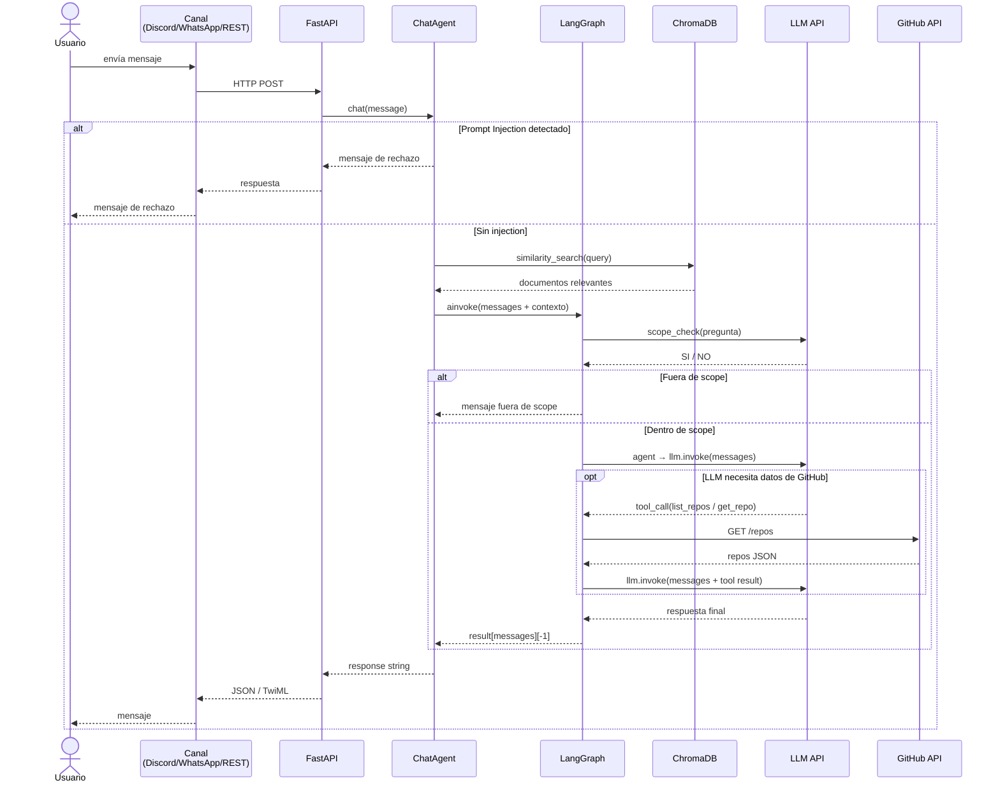

```mermaid
sequenceDiagram
    actor Usuario
    participant Canal as Canal<br/>(Discord/WhatsApp/REST)
    participant FastAPI
    participant ChatAgent
    participant LangGraph
    participant ChromaDB
    participant LLM as LLM API
    participant GitHub as GitHub API

    Usuario->>Canal: envía mensaje
    Canal->>FastAPI: HTTP POST

    FastAPI->>ChatAgent: chat(message)

    alt Prompt Injection detectado
        ChatAgent-->>FastAPI: mensaje de rechazo
        FastAPI-->>Canal: respuesta
        Canal-->>Usuario: mensaje de rechazo
    else Sin injection
        ChatAgent->>ChromaDB: similarity_search(query)
        ChromaDB-->>ChatAgent: documentos relevantes

        ChatAgent->>LangGraph: ainvoke(messages + contexto)

        LangGraph->>LLM: scope_check(pregunta)
        LLM-->>LangGraph: SI / NO

        alt Fuera de scope
            LangGraph-->>ChatAgent: mensaje fuera de scope
        else Dentro de scope
            LangGraph->>LLM: agent → llm.invoke(messages)

            opt LLM necesita datos de GitHub
                LLM-->>LangGraph: tool_call(list_repos / get_repo)
                LangGraph->>GitHub: GET /repos
                GitHub-->>LangGraph: repos JSON
                LangGraph->>LLM: llm.invoke(messages + tool result)
            end

            LLM-->>LangGraph: respuesta final
            LangGraph-->>ChatAgent: result[messages][-1]
        end

        ChatAgent-->>FastAPI: response string
        FastAPI-->>Canal: JSON / TwiML
        Canal-->>Usuario: mensaje
    end
```
