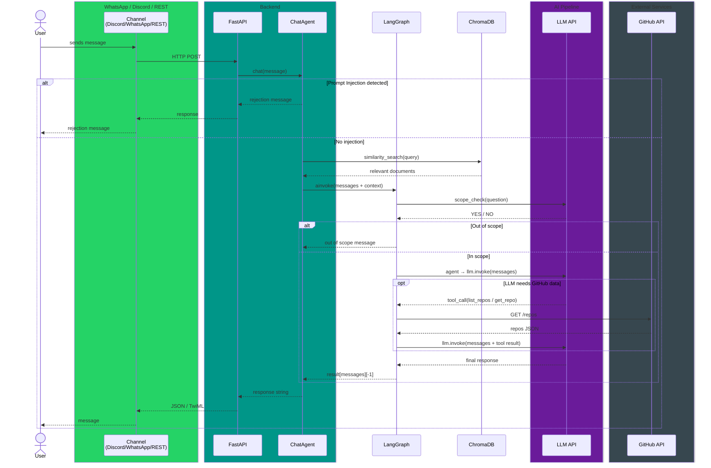

```mermaid
sequenceDiagram
    actor User
    participant Channel as Channel<br/>(Discord/WhatsApp/REST)
    participant FastAPI
    participant ChatAgent
    participant LangGraph
    participant ChromaDB
    participant LLM as LLM API
    participant GitHub as GitHub API

    box rgb(37,211,102) WhatsApp / Discord / REST
        participant Channel
    end
    box rgb(0,150,136) Backend
        participant FastAPI
        participant ChatAgent
    end
    box rgb(106,27,154) AI Pipeline
        participant LangGraph
        participant LLM
    end
    box rgb(55,71,79) External Services
        participant ChromaDB
        participant GitHub
    end

    User->>Channel: sends message
    Channel->>FastAPI: HTTP POST

    FastAPI->>ChatAgent: chat(message)

    alt Prompt Injection detected
        ChatAgent-->>FastAPI: rejection message
        FastAPI-->>Channel: response
        Channel-->>User: rejection message
    else No injection
        ChatAgent->>ChromaDB: similarity_search(query)
        ChromaDB-->>ChatAgent: relevant documents

        ChatAgent->>LangGraph: ainvoke(messages + context)

        LangGraph->>LLM: scope_check(question)
        LLM-->>LangGraph: YES / NO

        alt Out of scope
            LangGraph-->>ChatAgent: out of scope message
        else In scope
            LangGraph->>LLM: agent → llm.invoke(messages)

            opt LLM needs GitHub data
                LLM-->>LangGraph: tool_call(list_repos / get_repo)
                LangGraph->>GitHub: GET /repos
                GitHub-->>LangGraph: repos JSON
                LangGraph->>LLM: llm.invoke(messages + tool result)
            end

            LLM-->>LangGraph: final response
            LangGraph-->>ChatAgent: result[messages][-1]
        end

        ChatAgent-->>FastAPI: response string
        FastAPI-->>Channel: JSON / TwiML
        Channel-->>User: message
    end
```
